# LessonPlan

## Założenia:
Projekt jest aplikacją webową umożliwiającą każdemu zalogowanemu użytkownikowi na sprawdzenie planu zajęć. 
Nowi użytkownicy mają możliwość rejestracji. Konto po rejestracji należy aktywować klikając w link pojawiający się na stronie po założeniu konta. Każdy z użytkowników ma też przypisany pewną sekretną informację, która jest możliwa do odczytania tylko przez tego użytkownika, do którego ta informacja należy.
Aplikacja udostępnia także funkcje dla admina, który może zarządzać wszystkimi użytkownikami w systemie.

## Wykorzystane technologie:

- Django
- Angular
- Microsoft SQL 

## Jak uruchomić:

-Backend:

python -m pip install django-cors-headers,

pip install djangorestframework,

pip install django-pyodbc,

pip install mssql-django,


pip install pip install mysqlclient  

pip install django-utils-six

pip install django-crispy-forms   


py -3.10  manage.py runserver 

dodatkowo należy skonfigurować swoją bazę danych w settings.py

py -3.10 manage.py makemigrations databaseApp 

python manage.py migrate


-Frontend:

```yarn global add @angular/cli```

```yarn install```

```ng serve```


## Funkcjonalności:

Przy pierwszym odwiedzeniu strony należy się zarejestrować.

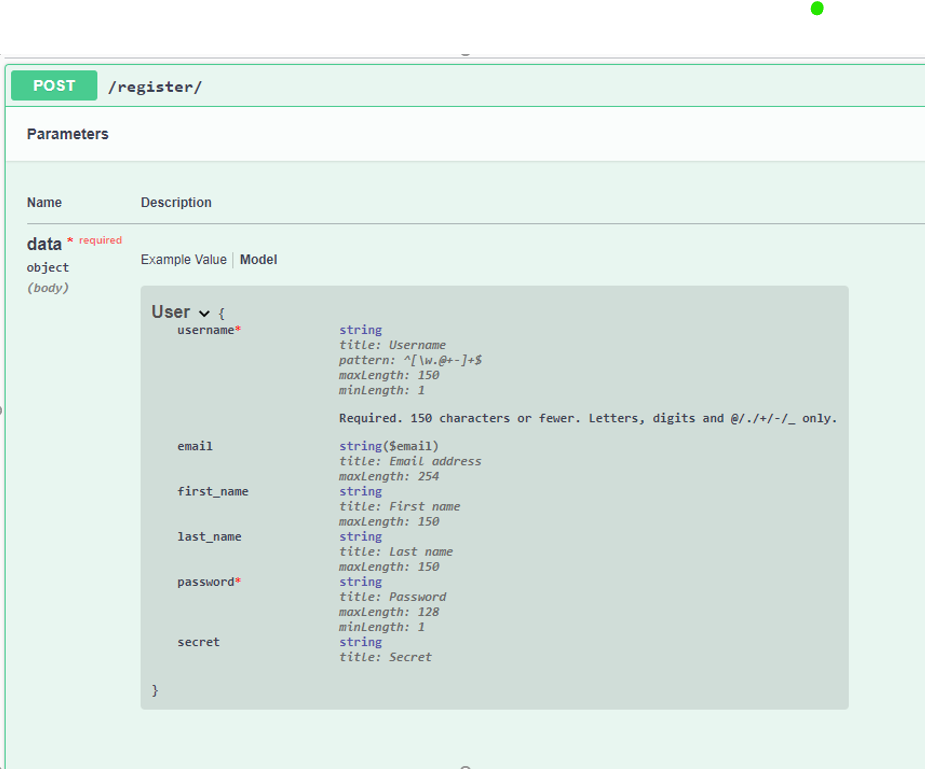

Użytkownik musi podać nazwę użytkownika oraz hasło, które składa się minimum z 8 znaków i zawiera przynajmniej jedną literę.
Po podaniu wszystkich wymaganych danych następuje rejestracja. 

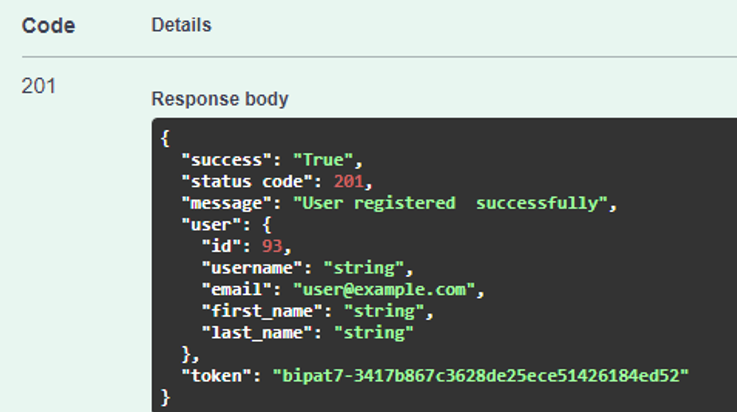

W odpowiedzi użytkownik otrzymuje link, który umożliwia mu aktywacje konta.

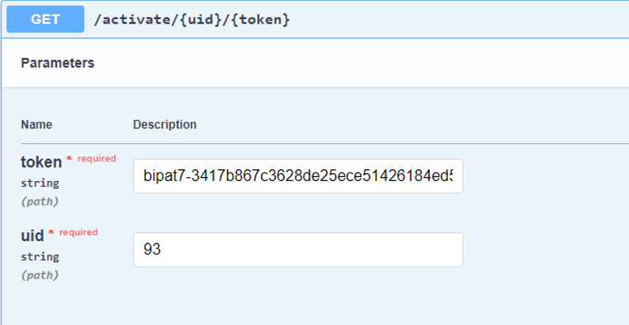

Jeśli podane id oraz token były zgodne następuje aktywacja konta.

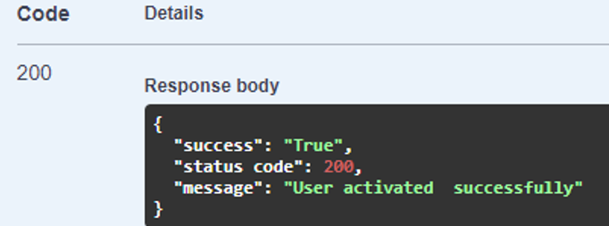

Po utworzeniu i aktywacji konta użytkownik może się zalogować. 

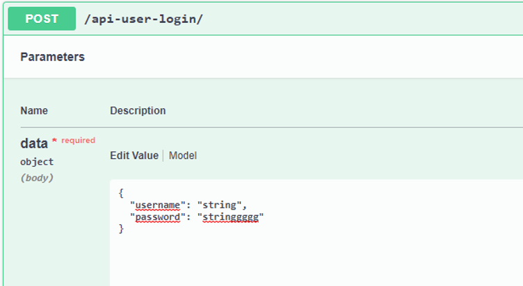

Jeśli dane są poprawne następuje zalogowanie.

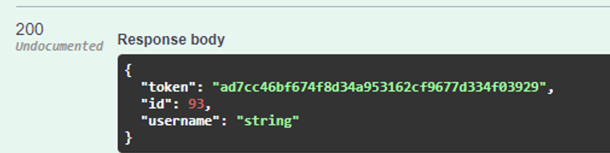

Teraz użytkownika ma już dostęp do wszystkich funkcji programu. 

Użytkownika ma możliwość przeglądania swojego planu zajęć i swoich danych prywatnych oraz może sie wylogowac z aplikacji.

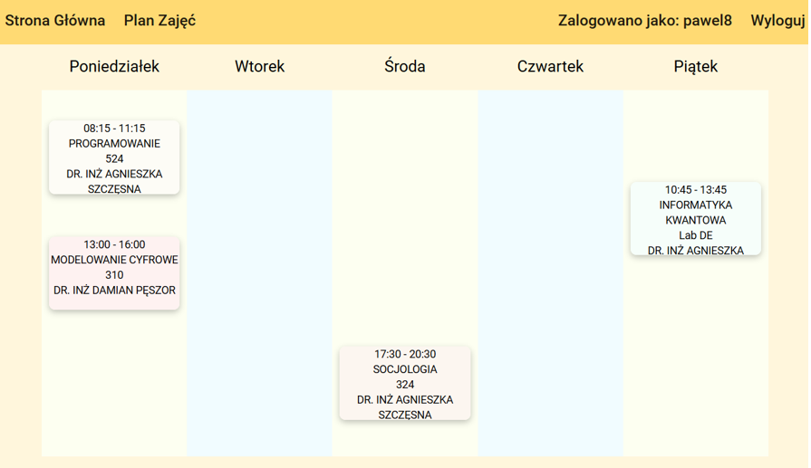

Po zalogowaniu użytkownik ma też możliwość zobaczenia swojej sekretnej wiadomości.

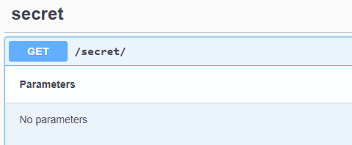

W celu zabezpieczenia wykradzenia tej informacji, treść wiadomości wyświetlana jest tylko dla aktualnie zalogowanego użytkownika.

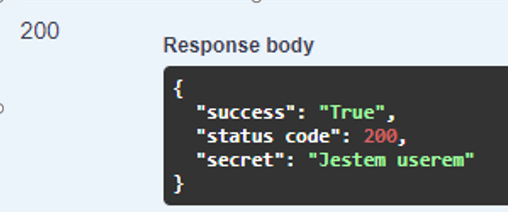


Wizualizacja projektu:


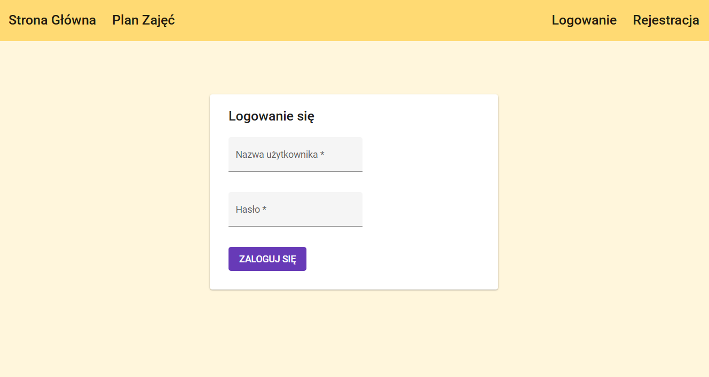


# Marchew

## Założenia:
Projekt jest grą napisaną w OpenGL, w której gracz wciela się w farmera sadzącego marchewki. W nocy pojawiają się króli, przed którymi należy chronić marchewki.

## Wykorzystane technologie:

- OpenGL
- Glad

## Jak uruchomić:
zbuduj projekt

## Funkcjonalności:
- poruszanie: WSAD
- sadzenie marchewki: Q
- zbieranie marchewki: E
- widok wireframe: F1

# BookCatalog

## Założenia:
Projekt to aplikacja webowa, która po rejestracji i zalogowaniu umożliwia przeglądanie listy książek, dodawanie wybranych do swojego konta wraz z oznaczeniem na jakim etapie czytania jest użytkownik oraz komentowania wybranych pozycji.

## Wykorzystane technologie:

- ASP.NET
- Entity Framework
- LINQ
- async/await


## Jak uruchomić:
zbuduj projekt

## Funkcjonalności:
- rejestracja nowego użytkownika
- logowanie
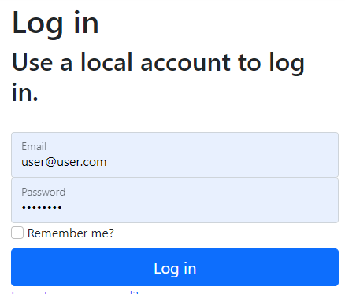
- crud książek
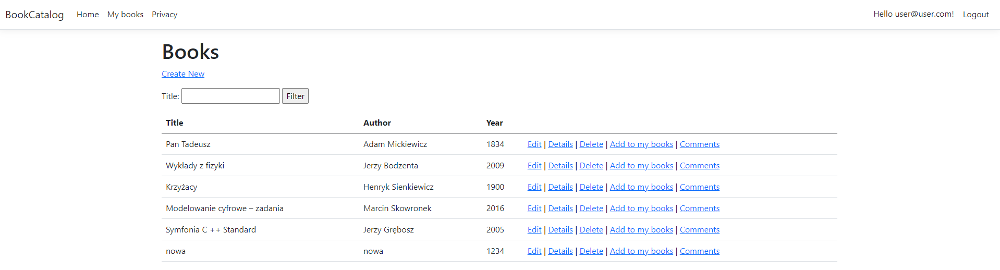

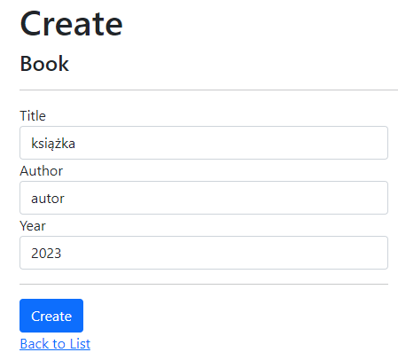
- filtrowanie listy książek po tytule
- dodawanie książek do swojego konta wraz z oznaczeniem etapu przeczytania danej pozycji
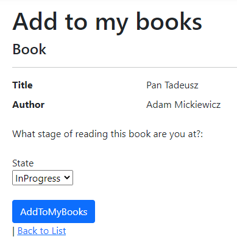

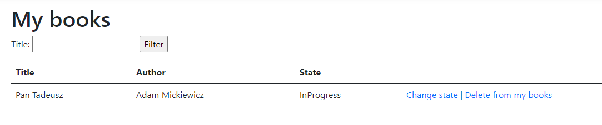
- komentowanie wybranych książek oraz usuwanie własnych komentarzy
- przeglądanie wszystkich komentarzy dodanych do danej książki
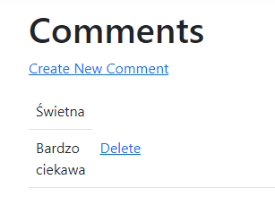

